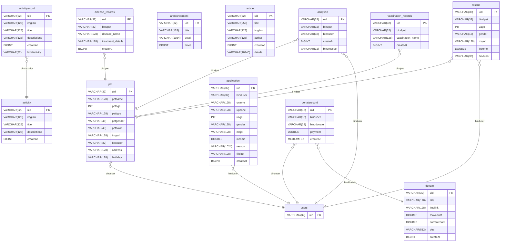

```mermaid
erDiagram
    activity {
        VARCHAR(32) uid PK
        VARCHAR(128) imglink
        VARCHAR(128) title
        VARCHAR(128) descriptions
        BIGINT createAt
    }
    activityrecord {
        VARCHAR(32) uid PK
        VARCHAR(128) imglink
        VARCHAR(128) title
        VARCHAR(128) descriptions
        BIGINT createAt
        VARCHAR(32) bindactivity
    }
    users {
        VARCHAR(32) uid PK
    }
    pet {
        VARCHAR(32) uid PK
        VARCHAR(128) petname
        INT petage
        VARCHAR(128) pettype
        VARCHAR(45) petgender
        VARCHAR(45) petcolor
        VARCHAR(128) imgurl
        VARCHAR(32) binduser
        VARCHAR(128) address
        VARCHAR(128) birthday
    }
    adoption {
        VARCHAR(32) uid PK
        VARCHAR(32) bindpet
        VARCHAR(32) binduser
        BIGINT createAt
        VARCHAR(32) bindrescue
    }
    announcement {
        VARCHAR(32) uid PK
        VARCHAR(128) title
        VARCHAR(1024) detail
        BIGINT times
    }
    application {
        VARCHAR(32) uid PK
        VARCHAR(32) binduser
        VARCHAR(128) uname
        VARCHAR(128) uphone
        INT uage
        VARCHAR(128) gender
        VARCHAR(128) major
        DOUBLE income
        VARCHAR(1024) reason
        VARCHAR(128) filelink
        BIGINT createAt
    }
    article {
        VARCHAR(32) uid PK
        VARCHAR(256) title
        VARCHAR(128) imglink
        VARCHAR(128) author
        BIGINT createAt
        VARCHAR(10240) details
    }
    disease_records {
        VARCHAR(32) uid PK
        VARCHAR(32) bindpet
        VARCHAR(128) disease_name
        VARCHAR(128) treatment_details
        BIGINT createAt
    }
    donate {
        VARCHAR(32) uid PK
        VARCHAR(128) title
        VARCHAR(128) imglink
        DOUBLE maxcount
        DOUBLE currentcount
        VARCHAR(512) des
        BIGINT createAt
    }
    donaterecord {
        VARCHAR(32) uid PK
        VARCHAR(32) binduser
        VARCHAR(32) binddonate
        DOUBLE payment
        MEDIUMTEXT createAt
    }
    rescue {
        VARCHAR(32) uid PK
        VARCHAR(32) bindpet
        INT uage
        VARCHAR(12) gender
        VARCHAR(128) major
        DOUBLE income
        VARCHAR(32) binduser
    }
    vaccination_records {
        VARCHAR(32) uid PK
        VARCHAR(32) bindpet
        VARCHAR(128) vaccination_name
        BIGINT createAt
    }

    activityrecord }o--|| activity : bindactivity
    pet }o--|| users : binduser
    adoption }o--|| pet : bindpet
    adoption }o--|| users : binduser
    application }o--|| users : binduser
    disease_records }o--|| pet : bindpet
    donaterecord }o--|| users : binduser
    donaterecord }o--|| donate : binddonate
    rescue }o--|| pet : bindpet
    rescue }o--|| users : binduser
    vaccination_records }o--|| pet : bindpet
```