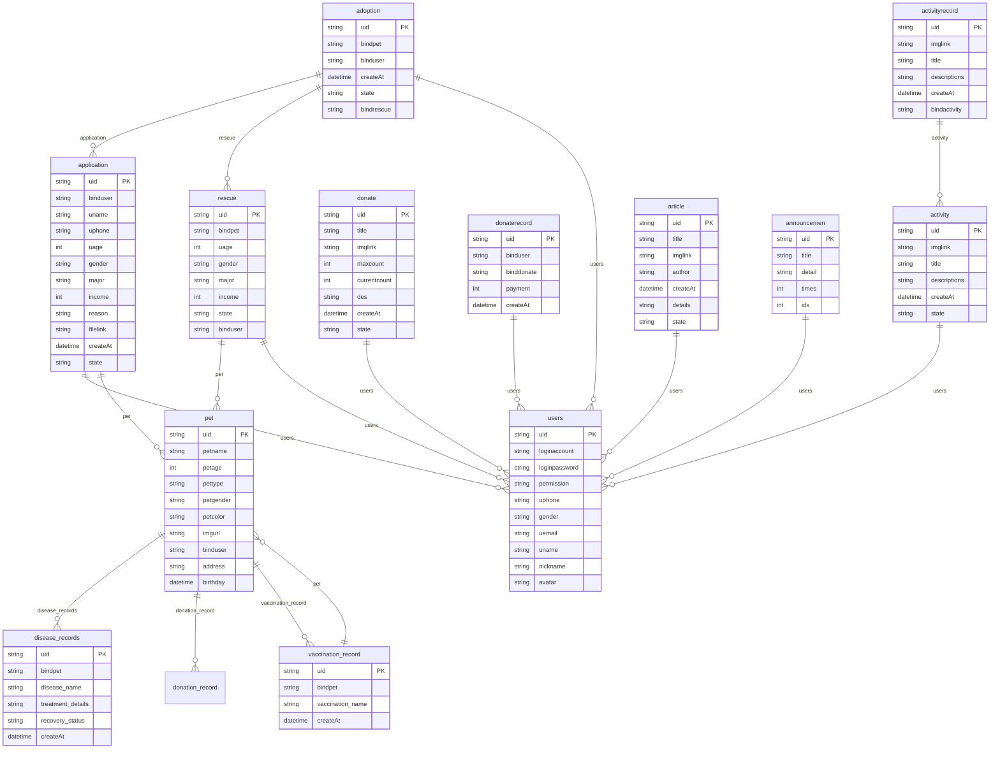

```mermaid
erDiagram
    adoption {
        string uid PK
        string bindpet
        string binduser
        datetime createAt
        string state
        string bindrescue
    }
    application {
        string uid PK
        string binduser
        string uname
        string uphone
        int uage
        string gender
        string major
        int income
        string reason
        string filelink
        datetime createAt
        string state
    }
    rescue {
        string uid PK
        string bindpet
        int uage
        string gender
        string major
        int income
        string state
        string binduser
    }
    users {
        string uid PK
        string loginaccount
        string loginpassword
        string permission
        string uphone
        string gender
        string uemail
        string uname
        string nickname
        string avatar
    }
    pet {
        string uid PK
        string petname
        int petage
        string pettype
        string petgender
        string petcolor
        string imgurl
        string binduser
        string address
        datetime birthday
    }
    disease_records {
        string uid PK
        string bindpet
        string disease_name
        string treatment_details
        string recovery_status
        datetime createAt
    }
    donate {
        string uid PK
        string title
        string imglink
        int maxcount
        int currentcount
        string des
        datetime createAt
        string state
    }
    donaterecord {
        string uid PK
        string binduser
        string binddonate
        int payment
        datetime createAt
    }
    vaccination_record {
        string uid PK
        string bindpet
        string vaccination_name
        datetime createAt
    }
    activityrecord {
        string uid PK
        string imglink
        string title
        string descriptions
        datetime createAt
        string bindactivity
    }
    activity {
        string uid PK
        string imglink
        string title
        string descriptions
        datetime createAt
        string state
    }
    article {
        string uid PK
        string title
        string imglink
        string author
        datetime createAt
        string details
        string state
    }
    announcemen {
        string uid PK
        string title
        string detail
        int times
        int idx
    }
    adoption ||--o{ application : "application"
    adoption ||--o{ rescue : "rescue"
    adoption ||--o{ users : "users"
    application ||--o{ users : "users"
    application ||--o{ pet : "pet"
    rescue ||--o{ pet : "pet"
    rescue ||--o{ users : "users"
    pet ||--o{ disease_records : "disease_records"
    pet ||--o{ donation_record : "donation_record"
    pet ||--o{ vaccination_record : "vaccination_record"
    donate ||--o{ users : "users"
    donaterecord ||--o{ users : "users"
    vaccination_record ||--o{ pet : "pet"
    activityrecord ||--o{ activity : "activity"
    activity ||--o{ users : "users"
    article ||--o{ users : "users"
    announcemen ||--o{ users : "users"

```