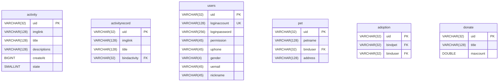

```mermaid
erDiagram
    activity {
        VARCHAR(32) uid PK
        VARCHAR(128) imglink
        VARCHAR(128) title
        VARCHAR(128) descriptions
        BIGINT createAt
        SMALLINT state
    }
    activityrecord {
        VARCHAR(32) uid PK
        VARCHAR(128) imglink
        VARCHAR(128) title
        VARCHAR(32) bindactivity FK
    }
    users {
        VARCHAR(32) uid PK
        VARCHAR(128) loginaccount UK
        VARCHAR(256) loginpassword
        VARCHAR(45) permission
        VARCHAR(45) uphone
        VARCHAR(4) gender
        VARCHAR(45) uemail
        VARCHAR(45) nickname
    }
    pet {
        VARCHAR(32) uid PK
        VARCHAR(128) petname
        VARCHAR(32) binduser FK
        VARCHAR(128) address
    }
    adoption {
        VARCHAR(32) uid PK
        VARCHAR(32) bindpet FK
        VARCHAR(32) binduser FK
    }
    donate {
        VARCHAR(32) uid PK
        VARCHAR(128) title
        DOUBLE maxcount
    }
```